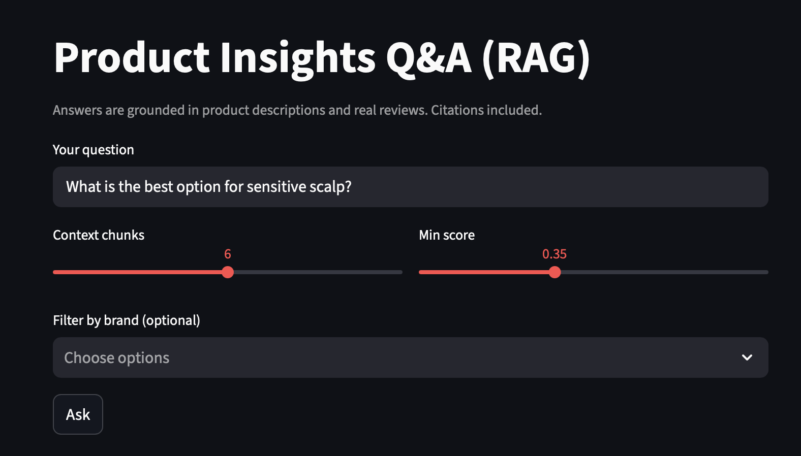
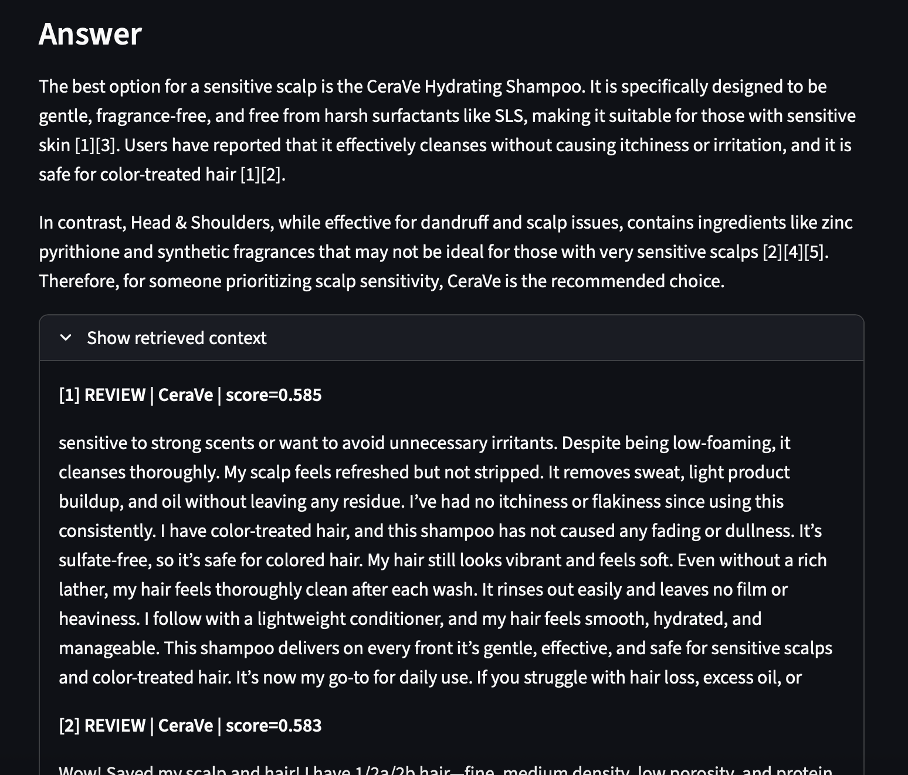

# Product Insights Q&A (GenAI RAG) 

This project demonstrates a retrieval-augmented generation (RAG) system for consumer products.
It allows users to ask natural language questions about multiple shampoo brands and receive grounded answers based on product descriptions and real customer reviews.

The goal is to showcase practical GenAI skills: data preprocessing, embeddings, vector search, retrieval pipelines, and building an interactive user interface.

⸻

## Features
 - Multi-brand comparison (e.g., Head & Shoulders vs Pantene vs CeraVe).
 - Evidence-based answers using OpenAI embeddings and GPT models.
 - FAISS vector index for semantic search over product descriptions and reviews.
 - Interactive Streamlit interface with adjustable parameters (context size, similarity threshold, brand filter).
 - Transparent citations and context display.

⸻

## Example

Question:
Which shampoo is best for dandruff and a sensitive scalp?

Answer (sample):
Head & Shoulders Classic Clean Anti-Dandruff Shampoo is formulated to combat flakes, itch, and dryness, making it effective against dandruff [2].
CeraVe Hydrating Shampoo is fragrance-free and suited for sensitive scalps, though it is not specifically marketed for dandruff [1][3].
If dandruff is the main concern, Head & Shoulders is more effective; if sensitivity is the issue, CeraVe is gentler.

Sources:
	•	[2] description | Head & Shoulders
	•	[1][3] reviews | CeraVe

⸻

## Screenshots

⸻

## Requirements
 - Python 3.10+
 - OpenAI API key
 - Packages: openai, faiss-cpu, streamlit, python-dotenv, pandas, numpy

⸻

## Notes
 - Index files (index/) and processed data are not committed; they can be rebuilt from raw CSVs.
 - The project can be extended to other product categories or larger datasets.
